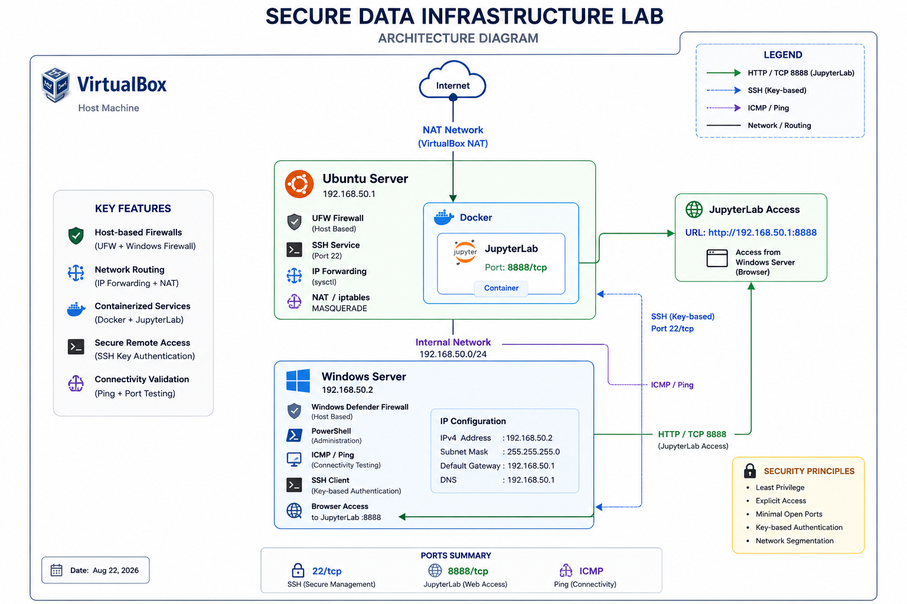
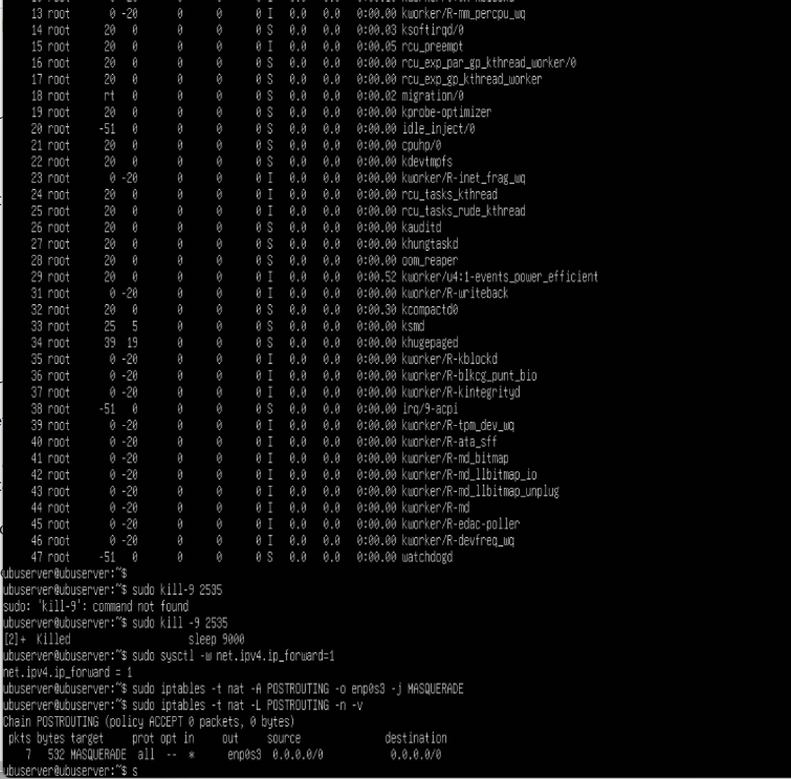
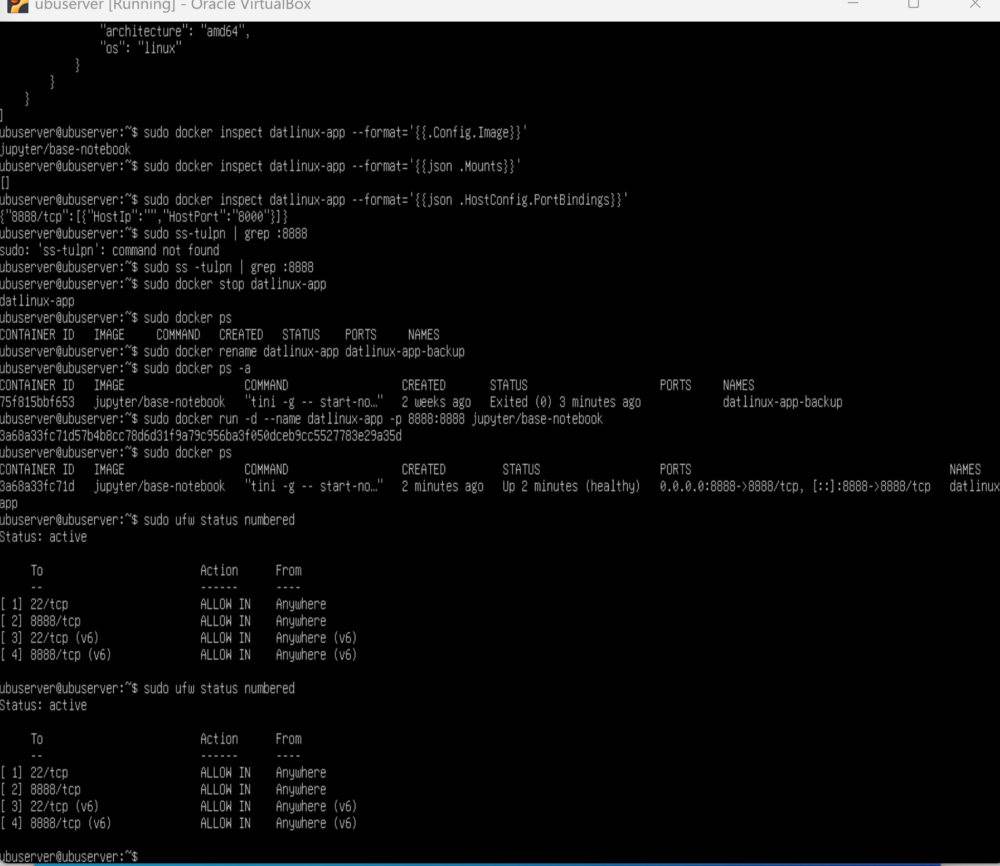

# Secure Data Infrastructure Lab

A cross-platform infrastructure lab focused on virtualization, Linux and Windows Server administration, networking, containerization, security hardening, remote administration, and data analytics.

The project was developed progressively as a cumulative Operating Systems laboratory and evolved into a functional two-node environment using Ubuntu Server and Windows Server.

## Architecture



The environment consists of two virtualized server nodes hosted with Oracle VirtualBox:

- **Ubuntu Server — 192.168.50.1**
- **Windows Server — 192.168.50.2**

Ubuntu Server provides routing, NAT, Docker services, JupyterLab, SSH, and host-based firewall protection.

Windows Server provides PowerShell administration, connectivity validation, firewall controls, SSH client access, and remote browser access to JupyterLab.

[View the full architecture documentation →](architecture/README.md)

---

## Technologies

- Ubuntu Server
- Windows Server
- Oracle VirtualBox
- Linux CLI / Bash
- PowerShell
- TCP/IP
- NAT
- IP Forwarding
- iptables
- SSH
- UFW
- Windows Defender Firewall
- Docker
- JupyterLab
- Python
- Pandas
- Matplotlib
- GitHub

---

## Project Modules

### 1. Virtualization

Deployment of Ubuntu Server and Windows Server as virtual machines using Oracle VirtualBox.

[View Virtualization →](virtualization/README.md)

### 2. Process Monitoring

Cross-platform process and resource monitoring using Linux `top`, Windows Task Manager, process IDs, and command-line process management.

[View Process Monitoring →](process-monitoring/README.md)

### 3. Access Control

Identification and remediation of overly permissive Linux file permissions using `chmod` and the principle of least privilege.

[View Access Control →](access-control/README.md)

### 4. Networking

Configuration of the internal `192.168.50.0/24` network, IP forwarding, NAT with `iptables`, gateway configuration, and connectivity validation between Ubuntu Server, Windows Server, and external networks.

[View Networking →](networking/README.md)

### 5. Docker & JupyterLab

Deployment of JupyterLab inside a Docker container on Ubuntu Server and remote access from Windows Server through TCP port `8888`.

[View Docker & JupyterLab →](docker-jupyter/README.md)

### 6. Security Hardening

Implementation of UFW, Windows Defender Firewall, controlled service exposure, ICMP validation, and SSH key-based authentication between Windows Server and Ubuntu Server.

[View Security Hardening →](security-hardening/README.md)

### 7. Data Analytics

End-to-end validation of the infrastructure through Python, Pandas, DataFrames, Matplotlib, and data visualization inside the containerized JupyterLab environment.

[View Data Analytics →](data-analytics/README.md)

---

## Key Technical Outcomes

The completed environment demonstrates:

- Cross-platform Linux and Windows Server administration
- Multi-node virtual infrastructure
- Internal network communication
- Ubuntu-based routing and NAT
- Docker container deployment
- Remote JupyterLab access
- Host-based firewall configuration
- SSH key-based authentication
- Process monitoring and administration
- Linux permission hardening
- Python-based analytics and visualization

---

## Selected Evidence

### Ubuntu Routing and NAT



### Docker and JupyterLab



### Data Analytics


---

## Repository Structure

```text
secure-data-infrastructure-lab/
│
├── architecture/
├── virtualization/
├── process-monitoring/
├── access-control/
├── networking/
├── docker-jupyter/
├── security-hardening/
├── data-analytics/
├── evidence/
└── README.md
```

---

## Skills Demonstrated

**Infrastructure:** VirtualBox, Ubuntu Server, Windows Server  
**Networking:** TCP/IP, routing, NAT, IP forwarding, ICMP  
**Security:** UFW, Windows Firewall, SSH keys, least privilege  
**Containers:** Docker, JupyterLab  
**Administration:** Bash, Linux CLI, PowerShell  
**Data:** Python, Pandas, Matplotlib

---

## Project Context

This repository presents selected technical documentation and evidence from a cumulative academic infrastructure project.

The documentation has been reorganized as a technical portfolio to emphasize architecture, implementation decisions, troubleshooting, security controls, and validated results.

Sensitive credentials, private keys, passwords, and unnecessary personal information are excluded.
