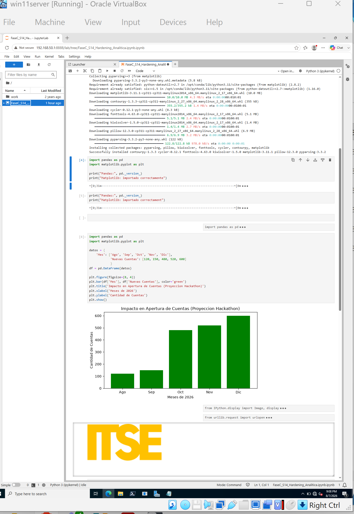

# Data Analytics

This section documents the validation of the infrastructure through a simple data analysis workflow executed inside JupyterLab.

The objective was to confirm that the containerized environment could successfully run Python-based analytics and visualization tasks after the infrastructure, networking, and security configuration had been completed.

## Python Environment

The JupyterLab environment was used to execute Python code and import:

- Pandas
- Matplotlib

These libraries were used to create a small structured dataset, convert it into a DataFrame, and visualize the results.

## DataFrame Creation

A simple dataset was created using monthly values and converted into a Pandas DataFrame.

Example structure:

```python
import pandas as pd
import matplotlib.pyplot as plt

data = {
    "Month": ["Aug", "Sep", "Oct", "Nov", "Dec"],
    "New Accounts": [120, 150, 480, 520, 600]
}

df = pd.DataFrame(data)

```

## Visualization

The dataset was visualized using Matplotlib with a bar chart.

This validated that the JupyterLab container could:

- Execute Python code
- Import analytics libraries
- Manipulate structured data
- Generate visualizations
- Serve the notebook remotely to the Windows Server node

## Infrastructure Validation

This analytics task served as an end-to-end validation of the environment.

The complete workflow demonstrated that:

1. Ubuntu Server provided the infrastructure and container host.
2. Docker hosted the JupyterLab environment.
3. Windows Server accessed the service through the internal network.
4. Firewall rules allowed the required traffic.
5. Python analytics executed successfully inside JupyterLab.

## Evidence

The following image shows the JupyterLab notebook running Pandas and Matplotlib and generating the visualization:


